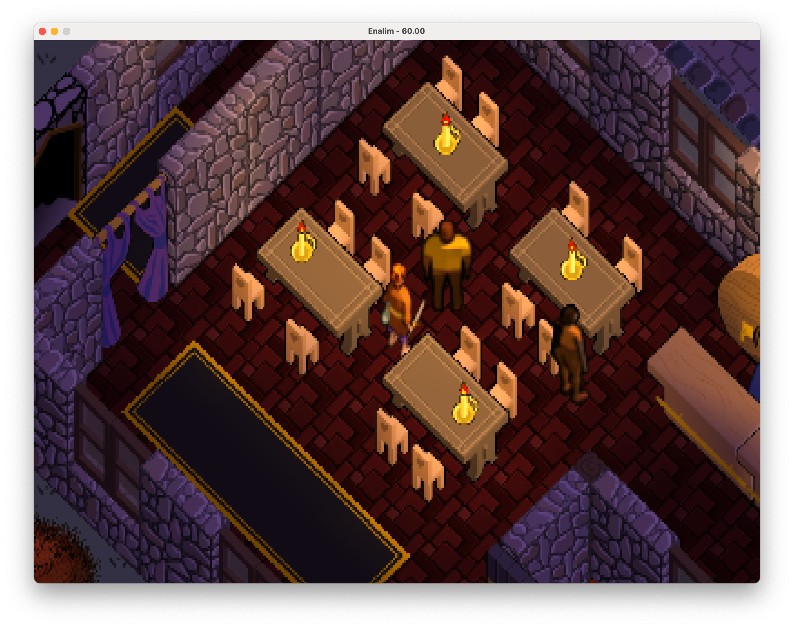
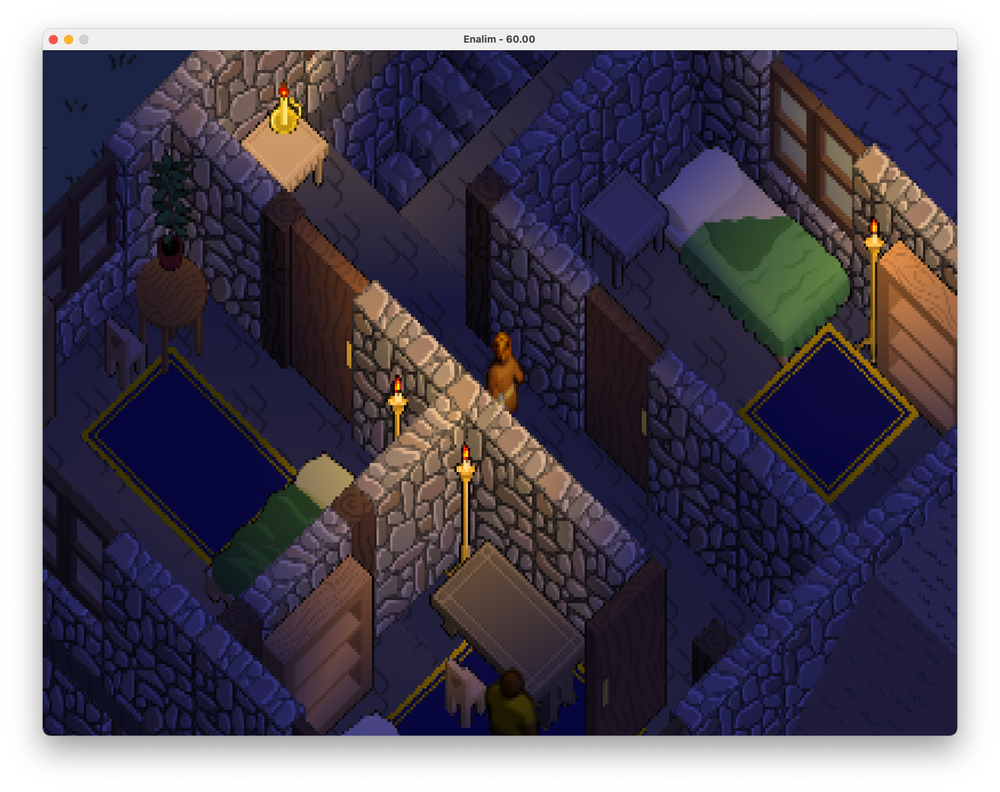
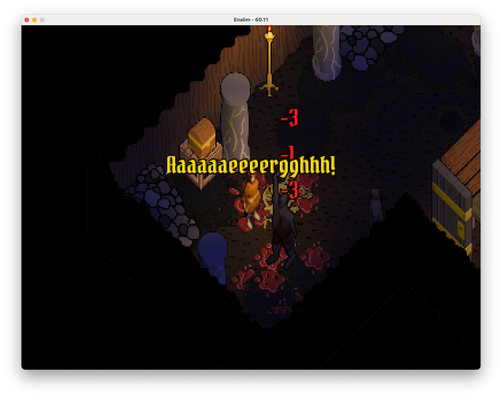
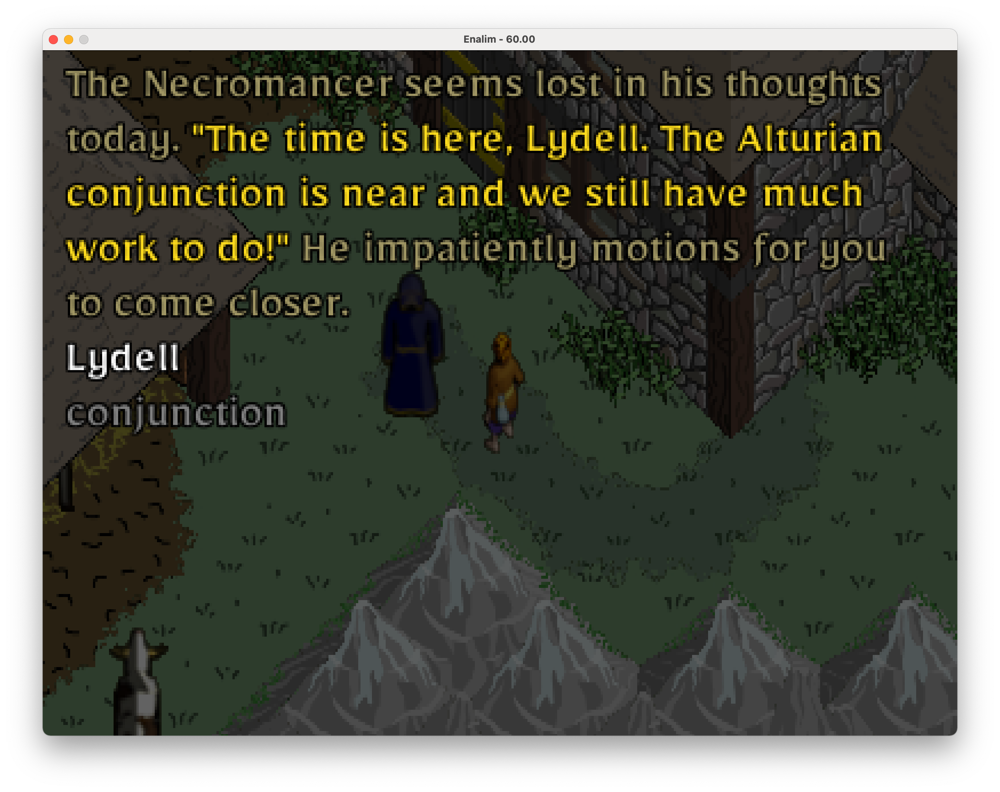
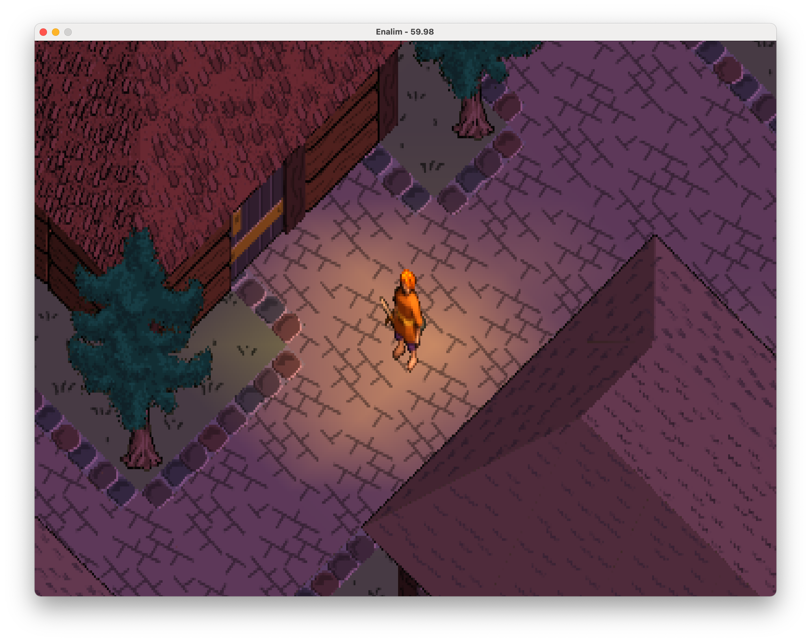
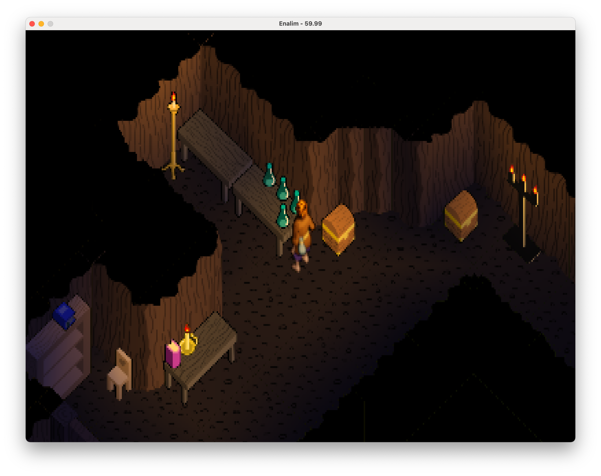

<a href="https://raw.githubusercontent.com/uzudil/enalim/main/images/screens/inn.png"></a> <a href="https://raw.githubusercontent.com/uzudil/enalim/main/images/screens/lights2.png"></a> <a href="https://raw.githubusercontent.com/uzudil/enalim/main/images/screens/combat2.png"></a>

# The legend of Enalim

You are a neophite magician, working as an assistant to the Necromancer. One  day, while running a routine errand for your master, your life changes as you are whisked away on an epic adventure. Your quest will take you to forests, swamps, icy peaks and dungeons of the vast land of Enalim.

`enalim` is an old-school, isometric, action-rpg, running on modern hardware. It is actively in development with the delivery date firmly set to "eventually". `enalim` is written in [bscript](https://github.com/uzudil/bscript), running on the [isongn](https://github.com/uzudil/isongn) rendering engine.

<a href="https://raw.githubusercontent.com/uzudil/enalim/main/images/screens/convo.png"></a> <a href="https://raw.githubusercontent.com/uzudil/enalim/main/images/screens/town.png"></a> <a href="https://raw.githubusercontent.com/uzudil/enalim/main/images/screens/dungeon.png"></a>


To play, clone this repo, build and run the game:
```bash
git clone https://github.com/uzudil/enalim.git
cd enalim
go build
./enalim
```

2021 (c) Gabor Torok


