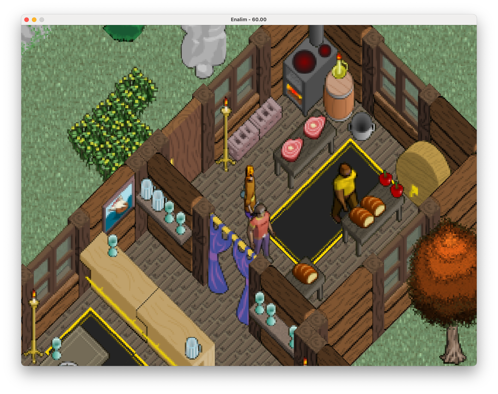
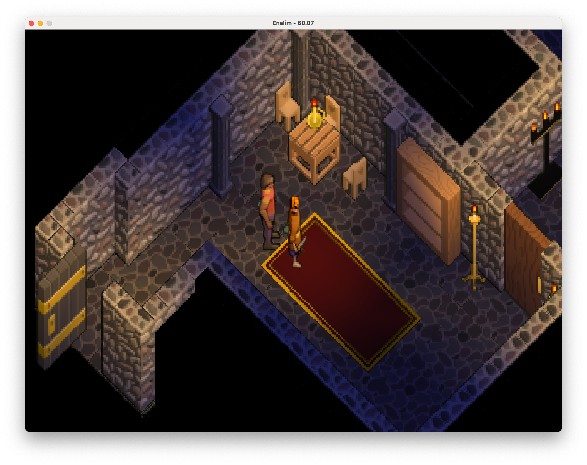
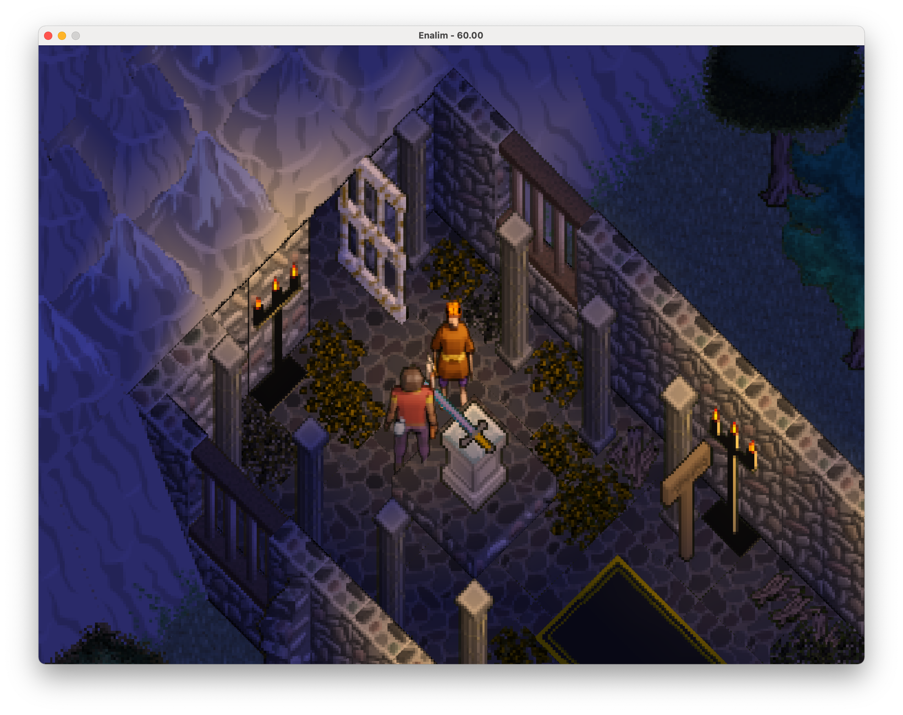
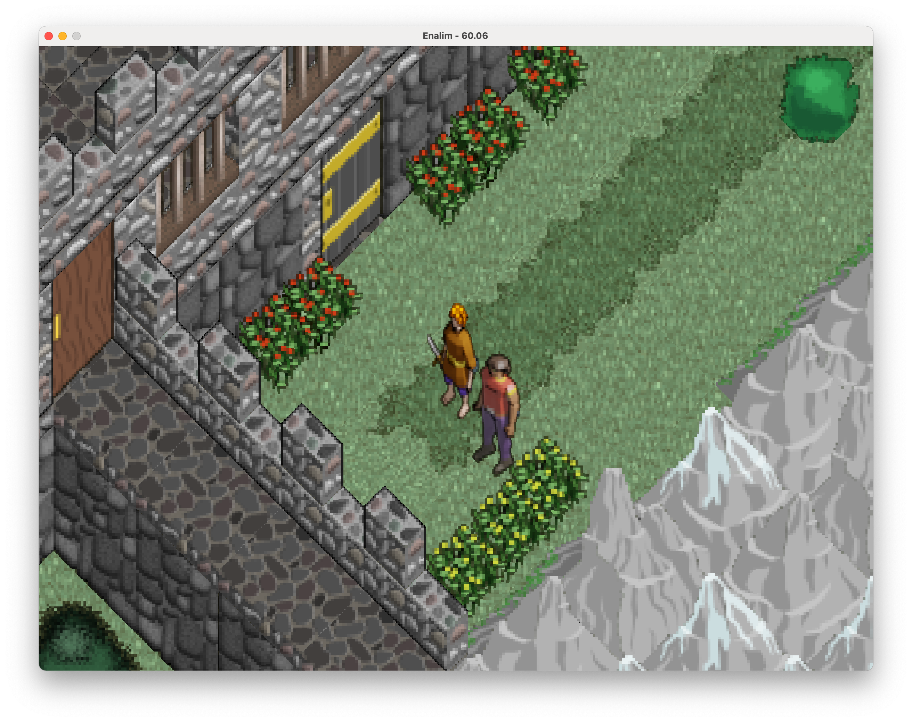
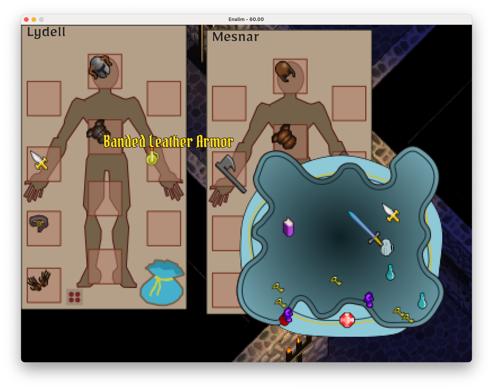
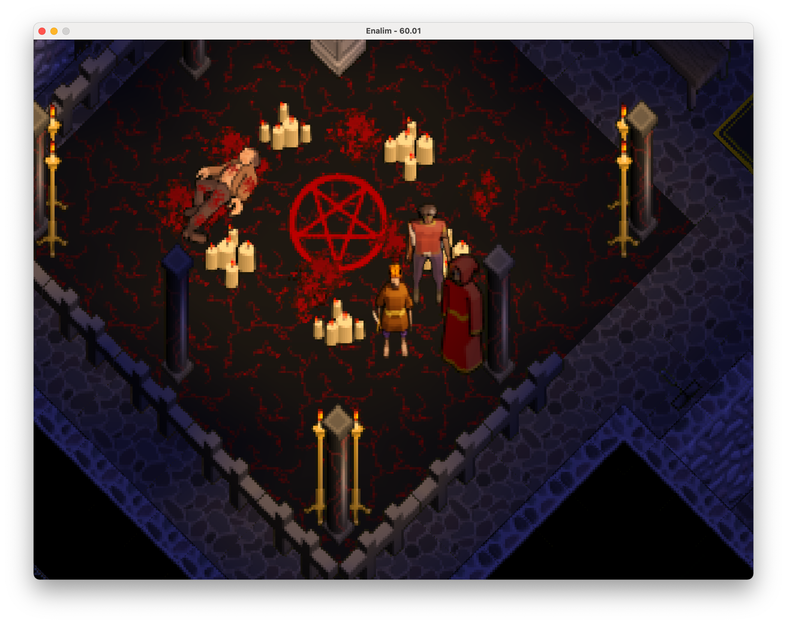
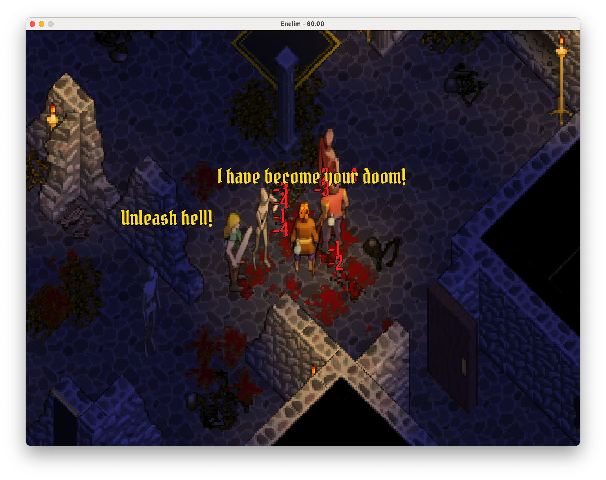

<a href="https://raw.githubusercontent.com/uzudil/enalim/main/images/screens/sagesbrew.png"></a> <a href="https://raw.githubusercontent.com/uzudil/enalim/main/images/screens/delude2.png"></a> <a href="https://raw.githubusercontent.com/uzudil/enalim/main/images/screens/sceptre.png"></a>

# Enalim: the Ecstasy of Brigo

You, Lydell, apprentice to the Necromancer and one with a hazy past, are cast ashore the land of Enalim with the nebulous goal to restore an ancient order to its former glory. Or something like that anyway. The more you explore the vast continent the more you doubt that the story is that simple. Where will your quest lead you? Will you find companions willing to shoulder the burden you carry? Or will you fall prey to the nefarious agents of Vesnu who are plotting your demise at every step.

`enalim` is an old-school, isometric, story-driven rpg, running on modern hardware. It is actively in development with the delivery date firmly set to "eventually". `enalim` is written in [bscript](https://github.com/uzudil/bscript), running on the [isongn](https://github.com/uzudil/isongn) rendering engine.

# Contributors welcome

The ideal contributor is someone with a passion for [this type of game](https://en.wikipedia.org/wiki/Ultima_VII:_The_Black_Gate) who doesn't mind drawing, 3d modeling, coding in golang and javascript ([kind of...](https://github.com/uzudil/bscript)) or making music. OpenGL/shader knowledge a plus! Realistically, this game will not make you rich or help you get that job at Google. If I haven't scared you off yet, let me know - preferrably via a pull request.

Wiki page on [How to Contribute](/wiki/How-to-Contribute)

<a href="https://raw.githubusercontent.com/uzudil/enalim/main/images/screens/convo2.png"></a> <a href="https://raw.githubusercontent.com/uzudil/enalim/main/images/screens/aneil.png"></a> <a href="https://raw.githubusercontent.com/uzudil/enalim/main/images/screens/inventory.png"></a>

# How to play
You can download pre-built binaries from the nightly release:
https://github.com/uzudil/enalim/releases/tag/nightly

Or, install from source:
[Install go](https://go.dev/doc/install), clone this repo, build and run the game:
```bash
brew install go
git clone https://github.com/uzudil/enalim.git
cd enalim
go build
./enalim
```

# Current development status

`enalim` is in active development and the game's status is `pre-alpha`. You can explore the start of the story, complete some quests, gain companions and items/treasure. You can marvel at the day/night cycles, explore the land and its caves/dungeons. Combat at the moment is basically a place-holder (you suffer no damage.) Spells, stats, states, as well as many critical items don't yet exist. The game works best at its intended resolution; there are known issues with full-screen mode.

<a href="https://raw.githubusercontent.com/uzudil/enalim/main/images/screens/ritual.png"></a> <a href="https://raw.githubusercontent.com/uzudil/enalim/main/images/screens/delude.png"></a>

2022 (c) uzudil

